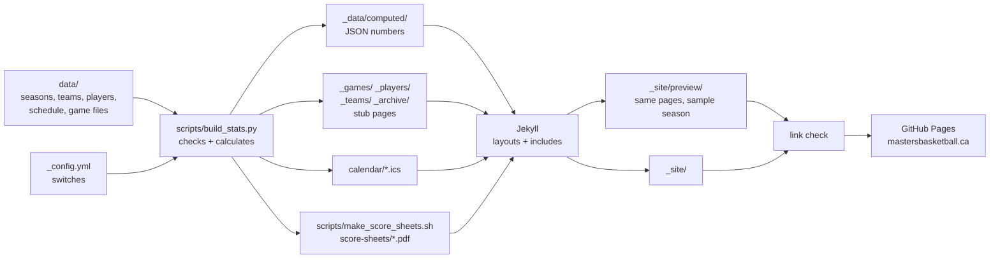

# Masters Basketball League · Thunder Bay

The league's website: standings, schedule, team pages, player stats and past
seasons. Live at **https://mastersbasketball.ca/**.

It is a static site. Volunteers type game results into small text files in
`data/`. A Python script checks them and works out every number. Jekyll turns
the numbers into pages, and GitHub Actions publishes them to GitHub Pages
whenever `main` changes.

- **Keeping the stats up to date** (for volunteers, no coding needed):
  [`docs/stats-workflow.md`](docs/stats-workflow.md)
- **Rules for anyone changing the code**, including Claude Code: [`CLAUDE.md`](CLAUDE.md)

---

## To do

### 1. Open questions

The full list, with answers so far, is in
[`docs/open-questions.md`](docs/open-questions.md). Still open:

**League decisions:**
- [ ] **Rosters for 2026-27.** Every player as "First L.", their team, and who
      is a sub. `data/2026-27/players.yml` is empty until then, so team pages
      say "No players listed yet".
- [ ] **Jersey numbers for 2026-27.** They go in `players.yml` as `number:`,
      show as "#23 Dave M." wherever a player is named, and print in the score
      sheets' # box (blank until then). Two players on one team with the same
      "First L." must both have one, or the build stops.
- [ ] **League rules.** `rules/index.md` (the League rules page, linked in the
      footer) has every section with a `[placeholder]` to replace.
- [ ] **Technical foul rules.** What happens after two in a game, or a number
      in a season? The site counts technicals (playoffs included) but flags
      nothing until this is decided.
- [ ] **Standings tiebreakers**, including three-way ties, for teams level on
      points. Until then the site uses head-to-head, then point differential,
      and says so under the standings.
- [ ] **Tied quarters and overtime (to confirm).** Standings points are 1 per
      quarter won and 3 per win. The site assumes a tied quarter gives neither
      team a point, and that overtime isn't a quarter.
- [ ] **Playoff matchups.** The play-in (G41, Wed Apr 21) is "TBD vs TBD" in
      `schedule.csv`. Fill in each playoff row as the standings decide it.
- [ ] **League contact for the footer.** Set `contact_url` in `_config.yml`
      (an email `mailto:` link or a form). The footer shows no contact link
      while it's blank. A form (e.g. a Google Form) keeps the address away
      from spam bots, which read email links straight from the page.

### 2. Record a game from a photo of the score sheet (`/record-game`)

Today a volunteer types each game into a YAML file by hand
([how](docs/stats-workflow.md#add-a-game)). The goal is a Claude Code skill or
slash command, `/record-game`, that turns a photo or scan of the paper score
sheet into that file and a pull request:

1. **The sheet is ready:** form MBL-SS6, from `scripts/scoresheet/scoresheet.py`
   ([README](scripts/scoresheet/README.md)). It has corner squares for
   straightening a photo, and the Schedule page links each game day's
   pre-filled sheet. Still needed: a photo of a real, filled-in one to build
   and test against.
2. **Read the sheet** ([how each stat comes from it](docs/stats-workflow.md#how-stats-come-from-a-sheet)):
   - **Here** ticks give GP
   - running score jumps give each player's points
   - filled and slashed circles give FTM and FTA
   - slashed foul boxes give `pf`, slashed red T boxes give `tech`
   - the Q1 to Q4 (and OT) boxes give each team's running total at the end of
     each quarter, for the quarter scores
   - **Notes** on page 1 give flagrant fouls (team, player number, quarter).
     A flagrant is also a personal foul, so it's in the foul boxes (`pf`) too
   - check: last running total = Final box; each quarter box = the running
     total at that quarter's line; player points add up to the final
3. **Match names to player ids** in `players.yml`:
   - Player ids are matched by **team, then first name and last initial**
     ("Dave M." on Hustle is `dave-m`). Jersey numbers are kept only in
     `players.yml` (the roster file), so a number change is one edit there.
   - **When a team has two players with the same "First L."**, the jersey
     number decides. The build insists both have a `number`, and the sheet
     prints it beside each name.
   - Ask about anyone it can't match, and add new players or subs (`sub: true`).
   - Never write a full name; players are always "First L.".
4. **Write the files:**
   - `data/2026-27/games/<game_id>.yml`, with the id taken from `schedule.csv`
     by date and teams, including `quarters` (the Q1 to Q4 boxes) and any
     `flagrant` fouls from Notes
   - the photo as `data/2026-27/sheets/<game_id>.jpg`
5. **Run the checks** (`python scripts/build_stats.py --check`) and fix
   anything they report, such as points that don't add up to the final.
6. **Show a summary to confirm**, then open a pull request. Merging it
   publishes the game.

It would live in `.claude/skills/record-game/SKILL.md` (or as a command), and
`docs/stats-workflow.md` would gain a "Record a game from a photo" section.

### 3. Build `players.yml` from the team rosters (`/build-roster`)

Rosters will arrive one team at a time, probably as a spreadsheet or CSV per
team, maybe as a photo or PDF. The goal is a Claude Code command,
`/build-roster`, like `/record-game`: give it a set of rosters and it updates
`data/<season>/players.yml` and opens a pull request. `players.yml` stays the
one source of truth for ids, display names and numbers.

1. **Read each roster:** first name, last name, jersey number, team, and
   whether the player is a sub. Ask about anything it can't read or any team
   it can't match to `teams.yml`.
2. **Match each row to an existing player** on the same team by "First L.",
   and if two share it, by number.
   - **Add only players who are new by name.** Existing ids are never
     rewritten, because every game file points at them.
   - **New ids** follow the usual rule: `dave-m`, then `dave-m2` for a second
     "Dave M." in the league. `dave-mo` style ids are also accepted.
   - **Update numbers** from the rosters. A number lives only in
     `players.yml`, so a change shows everywhere at once, past box scores
     included.
   - **Players missing from a roster** are listed for the volunteer to
     decide on, never deleted: their games still point at them.
3. **Keep only "First L."** in `players.yml`. Full last names are read for
   matching and never written to the repo (nor are the roster files).
4. **Run the checks** (`python scripts/build_stats.py --check`). They fail on a
   duplicate id, a number used twice on one team, and two players on one team
   with the same "First L." and no numbers to tell them apart.
5. **Show a summary to confirm** (added, number changes, not on a roster),
   then open a pull request. Merging it publishes the rosters.

It would live in `.claude/skills/build-roster/SKILL.md` (or
`.claude/commands/build-roster.md`). If the matching rules prove fiddly, a
small helper (`scripts/build_roster.py`, with tests) can do the matching and
id assignment so the command only reads the rosters and confirms.
`docs/stats-workflow.md` would gain an "Add the rosters" section.

---

## How the site works

### The big picture



1. **People edit `data/`.** These files are the only source of truth: game
   results, players, the schedule.
2. **`scripts/build_stats.py` checks and calculates.** It reads every season,
   checks every rule, and stops with a list of every problem if anything is
   wrong. Otherwise it writes:
   - the numbers as JSON
   - one tiny "stub" page per game, player, team and archived season
   - the calendar files
3. **Jekyll builds the pages.** Templates read the JSON and the stubs and
   produce plain HTML in `_site/`. No number is typed into a template. A second
   build makes the hidden preview copy from the sample season in
   `_site/preview/` (`scripts/build_preview.sh`).
4. **A link check** (`scripts/check_links.sh`) fails the build if any page,
   image, stylesheet or script is missing.
5. **GitHub Actions publishes `_site/`** to GitHub Pages, but only from `main`
   and only when every step passed.

Everything in steps 2–3 is regenerated from scratch on every build. Nothing
generated is committed: `_data/computed/`, the stub folders, `calendar/` and
`_site/` are all git-ignored.

### Where the data lives

| File | What it holds | Edited by |
|---|---|---|
| `data/seasons.yml` | Every season, newest first. Marks which is `current`, which are sample (fake) data, the gym and its address, and the ranking minimums (`ppg_min_games`, `ft_min_attempts`) | hand, once a season |
| `data/<season>/teams.yml` | Team id (2 letters), name, 2-letter code, colour slot (1–5) | hand, once a season |
| `data/<season>/players.yml` | Player id (`mike-r`), display name ("Mike R."), team, `sub`, jersey `number` (the roster: the only place numbers live) | hand or `/record-game` |
| `data/<season>/schedule.csv` | One row per game: id, date, time, gym, home, away, `regular`/`playoff`, week, optional `status` (`cancelled`) and `round` (playoff round name) | hand |
| `data/<season>/games/<game_id>.yml` | One file per played game: final score, `quarters` (each team's running total at the end of Q1–Q4) and a line per player (points, FTM, FTA, and fouls: `pf`, `tech`, `flagrant`) | hand or `/record-game` |
| `data/<season>/sheets/<game_id>.jpg` | Photo of the paper sheet, kept for checking (not published) | hand or `/record-game` |
| `_config.yml` | `sample_data` (show the fake season), `score_sheet_links` (publish photos), `preview_site` (the sample copy at `/preview/`), `contact_url`, `search_engines` (off: pages ask not to be listed by Google), the domain | hand, rarely |

The file formats, id rules and stat rules (GP, PPG, FT%, standings points,
rounding, tiebreakers) are in [`data/CLAUDE.md`](data/CLAUDE.md). The seasons are:
- **`2026-27`:** the real, current season.
- **`sample-2026-27` and `sample-2025-26`:** made-up data from
  `scripts/make_sample_season.py`. They're only shown when `sample_data: true`.

### What `build_stats.py` does

**Checks.** Every problem is reported at once, and nothing is written until
there are none:
- Each team's player points add up to its final score, and there are no ties.
- `quarters` has 4 running totals per team that never go down, and Q4 equals
  the final score (or is tied, when the game went to overtime).
- `ftm ≤ fta`, `ftm ≤ pts`, and no field goals worth 1 point.
- Fouls fit the sheet (`pf` 0–5, `tech` 0–2), and `flagrant ≤ pf` (a flagrant
  is also a personal foul).
- Every player, team and game id exists and is unique.
- A game file matches its `schedule.csv` row (date, teams, type).
- No game file for a cancelled game, or for a playoff game whose teams are
  still `TBD`/`2nd`/`Winner G41`.
- Names are "First L.", times are 24-hour, dates are real, and a team doesn't
  play twice in one day.

**Calculates**, for every season in `seasons.yml`, written to
`_data/computed/<season>/`:

| File | Contents |
|---|---|
| `teams.json` | name, code, colour slot per team |
| `standings.json` | PTS (standings points), W, L, QW (quarters won), PCT, PF, PA, DIFF, rank; tiebreak notes; "through week N" |
| `players.json` | each player's totals: GP, PTS, PPG, FTM, FTA, FT%, season high; PF (kept, not shown); technical and flagrant fouls for the whole season, playoffs included |
| `leaders.json` | PPG and FT% leaders (the minimums `ppg_min_games` and `ft_min_attempts` come from `seasons.yml`); everyone with a technical foul; everyone with a flagrant foul |
| `rankings.json` | every player with their rank in each stat, for the Stats page |
| `games.json` | every played game's box score, with the points in each quarter, quarters won and the standings points earned |
| `game_logs.json` | each player's game-by-game lines |
| `schedule.json` | game days (weeks) with their games, byes, played/cancelled state, and which week is latest and next |
| `playoffs.json` | playoff games and totals, kept apart from the regular season |

Playoff games never count toward regular-season stats or standings. Standings
points are 1 per quarter won and 3 per win (`POINTS_PER_QUARTER` and
`POINTS_PER_WIN` in `build_stats.py`).

**Chooses the active season** and writes `_data/computed/active.json`: the
`current` season, or its sample stand-in while `sample_data: true`. It also
writes which seasons the Archive lists. Templates never name a season; they
read this file.

**Writes stub pages.** These are a few lines of front matter each, such as
`_games/2026-10-17-g1.md` with `season:` and `game_id:` (plus title and
description):
- one per game, for every season the Archive lists
- one per player and team, for the active season only (player ids repeat
  across seasons)
- one per archived season

**Writes the calendars** through `scripts/calendars.py`:
`calendar/<team id>.ics` and `calendar/league.ics`, from the `current` season
always.
- One event per game, Eastern time, 90 minutes, at St. Pat's with its address.
- Cancelled games are marked cancelled, and played games carry the score.
- Subscribers' calendars update on the next publish.

### How a page gets its data

Jekyll loads every JSON file in `_data/computed/` as `site.data.computed`.
Two small includes turn that into the variables every template uses:

- **`_includes/active-season.html`** (fixed pages): reads `active.json` and
  sets `season` (from `seasons.json`) and `stats` (that season's JSON files).
- **`_includes/page-season.html`** (generated pages): does the same for the
  season named in the stub's front matter (`page.season`), so an archived
  game's box score reads its own season.

**Fixed pages**, one file each:

| URL | File | Shows |
|---|---|---|
| `/` | `index.html` | latest results, standings (by points), next game day, leaders |
| `/schedule/` | `schedule/index.html` | upcoming game days (each with its score sheet PDF), then results; cancelled games; calendar links; blank score sheets |
| `/stats/` | `stats/index.html` | ranked list (PPG / Points / FT %, by team); full table at `#stats-table`; technical and flagrant foul lists at the bottom |
| `/teams/` | `teams/index.html` | a card per team |
| `/archive/` | `archive/index.html` | a card per season |
| `/rules/` | `rules/index.md` (layout `text`) | the league rules, written in Markdown; linked from the footer |
| `/404.html` | `404.html` | page not found |

**Generated pages:** a stub plus a layout. `_config.yml` declares four
collections; their `defaults` give each stub a layout and a nav tab.

| URL | Stub folder | Layout | Shows |
|---|---|---|---|
| `/games/<game_id>/` | `_games/` | `_layouts/game.html` | box score: score by quarter, both teams, every player, top scorer |
| `/players/<id>/` | `_players/` | `_layouts/player.html` | totals, techs and flagrant fouls, points-by-game-day bars, game log |
| `/teams/<id>/` | `_teams/` | `_layouts/team.html` | record, points, rank, roster, results, upcoming games, calendar |
| `/archive/<season>/` | `_archive/` | `_layouts/archive-season.html` | final standings, playoffs, leaders |

For example, the box score at `/games/2026-10-17-g1/`:
1. `build_stats.py` writes `_games/2026-10-17-g1.md` (`season: 2026-27`,
   `game_id: 2026-10-17-g1`).
2. Jekyll gives it `layout: game` (from `defaults`).
3. `game.html` includes `page-season.html`, looks up
   `stats.games["2026-10-17-g1"]` and draws it with `result-card.html`,
   `line-score.html` and `box-score-table.html`.

Every page uses `_layouts/default.html`:
- `head.html`
- `header.html`
- `sample-banner.html` (only in sample mode)
- the page
- `footer.html`

**Components** (`_includes/`), reused across pages:

| Include | What it draws |
|---|---|
| `head.html` | title, description, share tags, icons, fonts, CSS, the no-flash theme script |
| `header.html` / `footer.html` | badge, nav, theme button and the Sleeping Giant scene / wordmark and links (Teams, Past seasons, Score sheets, League rules, Contact when set) |
| `sample-banner.html` | "Preview with sample data" (sample mode and the `/preview/` copy, which also links to the live site) |
| `player-name.html` | a player as "#23 Dave M." (number from `players.yml`, when known) |
| `result-card.html` | a played game's score card |
| `standings-table.html` / `standings-points-note.html` | the standings table, ranked by points: PTS, W, L, QW, PCT, PF, PA, DIFF (scrolls sideways on phones, team column pinned) / the one-line note on how points work |
| `line-score.html` | a box score's "Score by quarter" table: Q1–Q4, OT, final, standings points |
| `next-game.html` | the blue "Next game day" panel |
| `leader-card.html` / `rank-row.html` | a leader's big number / a ranked player row |
| `stats-row.html` / `game-bars.html` | a Stats list row that expands / points-by-game-day bars |
| `schedule-week.html` / `game-row.html` / `bye-line.html` | a game day on the Schedule / one upcoming or cancelled game / who has the bye |
| `box-score-table.html` | one team's half of a box score |
| `team-card.html` / `season-card.html` | the cards on Teams and Archive |
| `calendar-links.html` | Subscribe / Download rows for the calendars |

### Look and behaviour

- **`brand/`** is the brand kit: logos, icons, the `--mb-*` colour variables
  for light and dark (`css/brand.css`), and the Sleeping Giant scenes.
  Don't edit it.
- **`assets/css/site.css`** holds all page styles, built only from the brand
  variables (no raw colours). Light and dark follow the phone's setting.
- **`assets/js/site.js`** runs the sun/moon button, which saves the choice in
  `localStorage`. A small script in `head.html` applies it before the page
  paints.
- **`assets/js/stats.js`** runs the Stats page: the PPG/Points/FT % switch,
  team filters, expanding rows and table sorting.
- **No framework.** Every page works with JavaScript off: Stats then shows
  plain lists and a readable table.
- The approved design is [`docs/design-brief.md`](docs/design-brief.md) and
  [`docs/mockups/`](docs/mockups/). Pages are checked at 360, 390 and 1440 px
  in both themes.

### Publishing

`.github/workflows/deploy.yml` runs on every push and pull request, and every
night at about 4 AM Thunder Bay time (08:17 UTC):

1. Install Python packages (`requirements.txt`: PyYAML, reportlab).
2. Run the unit tests (`tests/`).
3. `python scripts/build_stats.py`: check the data and write the JSON, stubs
   and calendars.
4. `scripts/make_score_sheets.sh`: score sheet PDFs for the season the site
   shows, into `score-sheets/`. That's every game day from today (Thunder Bay
   time) in all four layouts, plus blank sheets. The Schedule page links only
   the files that exist.
5. `bundle exec jekyll build` (production).
6. `scripts/build_preview.sh`: the hidden preview copy, the same site built
   from the sample season into `_site/preview/` (published at `/preview/`, with
   the sample banner). Off with `preview_site: false` in `_config.yml`.
7. `scripts/check_links.sh`: html-proofer over `_site/` (both copies), including
   the PDF links.
8. **On `main` only:** upload `_site/` and deploy it to GitHub Pages.

A pull request runs steps 1–7, so a red cross means "don't merge yet". The
nightly run rebuilds `main` with nothing changed, so the parts that depend on
today's date stay current: the score sheets (from today on), the "next game
day" panel and the calendar files. GitHub pauses scheduled runs after 60 days
without a push to the repo; re-enable it under Actions → Build and deploy. The
domain is set in the repo's Settings → Pages and in `_config.yml` (`url`) and
`CNAME`; DNS is at Porkbun ([`docs/domain.md`](docs/domain.md)).

### Running it on your computer

```sh
pip install -r requirements.txt        # Python 3.12, PyYAML, reportlab
bundle install                         # Ruby and Jekyll 4.4

python -m unittest discover -s tests   # unit tests
python scripts/build_stats.py          # check data; write JSON, stubs, calendars
scripts/make_score_sheets.sh           # score sheet PDFs (optional locally)
bundle exec jekyll serve --livereload  # http://localhost:4000/
bundle exec jekyll build && scripts/build_preview.sh && scripts/check_links.sh   # both copies

# every page at 360/390/1440 px, light and dark, sample and real data
# (needs: pip install playwright pillow)
python scripts/screenshot_all.py --out /tmp/shots --contact-sheets
```

Run `build_stats.py` again after changing anything in `data/` or the
`sample_data` switch.

### Common changes

| I want to… | Do this |
|---|---|
| Add a game result | add `data/2026-27/games/<game_id>.yml` ([guide](docs/stats-workflow.md#add-a-game)) |
| Fix a number | edit the game file; everything is recalculated |
| Add a player or sub | one line in `data/2026-27/players.yml` |
| Edit the league rules | `rules/index.md` ([guide](docs/stats-workflow.md#edit-the-league-rules)) |
| Cancel, move or make up a game | edit its row in `schedule.csv` ([guide](docs/stats-workflow.md#cancel-or-move-a-game)) |
| Set a playoff matchup | replace `TBD` / `2nd` / `Winner G41` with team ids in `schedule.csv` |
| Change a team's colour | its `colour_slot` (1–5) in `teams.yml` |
| See a change with fake numbers | open `/preview/` after it's merged (the sample-season copy), or set `sample_data: true` in `_config.yml` locally |
| Change a ranking minimum | `ppg_min_games` / `ft_min_attempts` in `data/seasons.yml` ([guide](docs/stats-workflow.md#change-a-ranking-minimum)) |
| Start a new season | add `data/<new season>/` (teams, players, schedule, empty `games/`), add it to the top of `seasons.yml` with `current: true`, and remove `current` from the old one. The old season moves to the Archive, keeping its standings, leaders and box scores, but no player or team pages. |

### Repository map

```
data/                    league data: the only thing edited week to week
  seasons.yml
  2026-27/               the real season: teams, players, schedule, games/, sheets/
  sample-2026-27/        made-up data (sample mode only)
  sample-2025-26/
scripts/
  build_stats.py         checks the data; writes JSON, stub pages, calendars
  calendars.py           the .ics files
  scoresheet/            the score sheet generator (form MBL-SS6): README, fonts, example data
  make_score_sheets.sh   score sheet PDFs for the season shown (CI)
  make_sample_season.py  regenerates the sample seasons
  build_preview.sh       the sample-season copy at /preview/ (CI)
  check_links.sh         link check (CI)
  screenshot_all.py      screenshots + page checks for QA
tests/                   unit tests for build_stats.py, calendars.py and score sheet data loading
_config.yml              site settings, switches, collections
_layouts/  _includes/    templates and components
index.html  schedule/  stats/  teams/  archive/  rules/  404.html   fixed pages
assets/css/site.css      page styles
assets/js/               theme button, Stats page
brand/                   brand kit (don't edit)
docs/
  stats-workflow.md      the volunteer's guide
  open-questions.md      league decisions still needed
  design-brief.md        the design spec and decisions
  mockups/               approved mockups
  domain.md              domain and DNS
  qa/                    full-site QA report (screenshots: run screenshot_all.py)
  screenshots/           screenshots from the build steps
.github/workflows/deploy.yml   build, check and publish
CNAME                    the domain, for GitHub Pages
```

Generated on every build and never committed: `_data/computed/`, `_games/`,
`_players/`, `_teams/`, `_archive/`, `calendar/`, `score-sheets/`, `sheets/`
(only when photos are published) and `_site/`.
