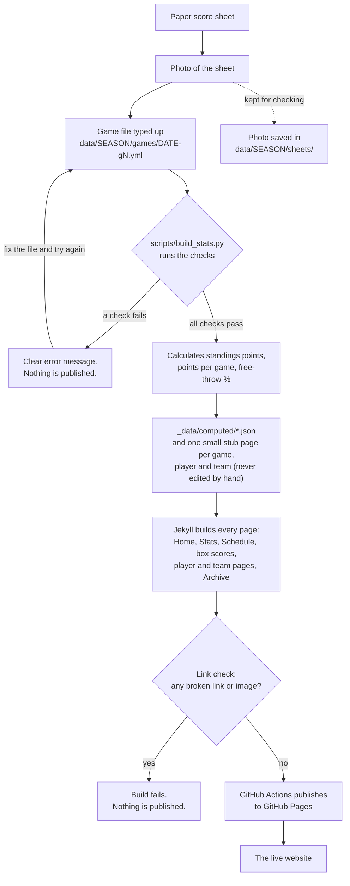

# How the stats work

A guide for whoever keeps the league's numbers up to date. You do not need to
be a programmer. Everything below can be done in GitHub's web editor in a
browser, and the site checks your work for you before anything goes live.

**The short version:** after each game day, the paper score sheets are typed
into one small text file per game. The site reads those files, double-checks
them, works out every number (standings, points per game, free-throw %), and
publishes the pages. If something doesn't add up, the check fails with a plain
message and **nothing is published**, so a typo can't put wrong numbers on the
site.

- [The path from score sheet to website](#the-path-from-score-sheet-to-website)
- [The data folders](#the-data-folders)
- [What a game file looks like](#what-a-game-file-looks-like)
- [The checks, and what a failure looks like](#the-checks-and-what-a-failure-looks-like)
- [How each number is calculated](#how-each-number-is-calculated)
- [How to](#how-to) — add a game, fix a number, add a player or sub, change a ranking minimum, the preview copy
- [If something looks wrong](#if-something-looks-wrong)

## The path from score sheet to website



What each step means in plain words:

| Step | Who or what does it | Where it lives |
|---|---|---|
| Score sheet and photo | A person at the game | Paper, then a photo on someone's phone |
| Game file | **You**, by typing the sheet's numbers | `data/<season>/games/<date>-g1.yml` |
| Checks | `scripts/build_stats.py` (automatic) | Runs on every change; see [the checks](#the-checks-and-what-a-failure-looks-like) |
| Calculations | `scripts/build_stats.py` (automatic) | Writes `_data/computed/`. Never edit those files; they are rewritten every time |
| Pages | Jekyll, the site builder (automatic) | Every page reads `_data/computed/`. The script also writes a tiny stub file for each game, player, team and archive season (folders `_games/`, `_players/`, `_teams/`, `_archive/`, rewritten every time), which is how each one gets its own page |
| Link check | `scripts/check_links.sh` (automatic) | Stops the publish if any link, image or script in the built site is broken |
| Publishing | GitHub Actions (automatic) | `.github/workflows/deploy.yml`. It only publishes when a change is **merged into `main`**, and again every night so the date-based parts stay current. Each publish also updates the [preview copy](#the-preview-copy-sample-data-at-preview) |

You only ever touch the game file (and occasionally the player list). The rest
happens by itself: add a game and its box score page, the players' pages and the
standings all update on their own.

## The score sheet

The league's score sheet is form **MBL-SS6**, made by
`scripts/scoresheet/scoresheet.py` ([its README](../scripts/scoresheet/README.md)).
Every time the site is published:

- **Upcoming game days:** each one on the Schedule gets a **Score sheet (PDF)**
  link (landscape Legal) and **Other layouts** (landscape Letter, portrait
  Letter and Legal). The sheet has both games, two pages each, with the date,
  start time, game ID and team names filled in. Each roster lists the team's
  regular players (not subs) in jersey-number order. Until the rosters are in
  `players.yml`, the 12 rows print blank. Every printed name and number is still
  an editable field, so last-minute changes can be typed in before printing.
- **Blank sheets:** all four layouts are at the bottom of the Schedule page.

Print double-sided. Page 2 has **How to mark** (the scorekeeper's
instructions) and the overflow: the running score past 100 points and free
throws past 10. Page 1 has a **Notes** box for flagrant fouls. Games are played
in quarters: the scorekeeper writes each team's running total at the end of
each quarter in the Q1 to Q4 boxes.

### How stats come from a sheet

The game file is a copy of the sheet, box for box (see
[What a game file looks like](#what-a-game-file-looks-like)). The site works
out every number from it:

| Stat | Source |
|---|---|
| Player points | Running score. The jump from the team's previous total to the next one (1, 2 or 3) goes to the jersey number written in that box. |
| FTM | Filled circles in the player's row. Never the running score: under league rules a free throw can be worth 1, 2 or 3 points, so any jump might be one. |
| FTA | Filled circles plus slashed circles. |
| GP | **Here** ticks. |
| PF (personal fouls) | Slashed foul boxes in the player's row (0 to 5). Kept, but not shown on the site. |
| Techs (technical fouls) | Slashed red **T** boxes in the player's row (0 to 2). |
| Quarter scores | The **Q1 to Q4** boxes (and **OT**): each team's running total at the end of each quarter. |
| Flagrant fouls | **Notes** on page 1: team, player number and quarter. A flagrant also counts as a personal foul, so it is in the player's foul boxes too. |
| Checks | The last running total equals the Final box. Each quarter box equals the running total at that quarter's line. Every scorer's number is on that team's roster and ticked Here. |

The sheet's team fouls and timeouts aren't on the site.

## The data folders

```
data/
  seasons.yml          which seasons exist, and which one is current
  2026-27/             the REAL season: real teams and schedule, rosters to come
    teams.yml            the five teams
    players.yml          every player and sub
    schedule.csv         every game day: who plays whom, when
    games/               one file per game that has been played
    sheets/              photos of the paper score sheets
  sample-2026-27/      FAKE sample season, standing in for the real one
  sample-2025-26/      FAKE past season, so the Archive has something to show
```

- **Real season:** `data/2026-27/`. The teams and the schedule are in;
  `players.yml` is empty until the rosters arrive, and `games/` fills up as
  games are played.
- **Sample seasons:** `data/sample-2026-27/` and `data/sample-2025-26/` are
  made-up data (made by `scripts/make_sample_season.py`) so the site looks real
  before the first game. The first stands in for the current season and the
  second is a short past season for the Archive. While sample mode is on, the
  website shows a banner saying so, and the Archive lists both. With it off,
  neither is shown on the main site, but both are on the hidden
  [preview copy](#the-preview-copy-sample-data-at-preview) at `/preview/`. See
  [Sample mode](#sample-mode-now-off) (it is off now).
- **Which season is shown** is decided in one place, `data/seasons.yml`:
  `current: true` marks the real season, and `stands_in_for: 2026-27` marks
  the sample that replaces it while sample mode is on.

## What a game file looks like

A game file is a **digital copy of the paper score sheet**: you copy the boxes
as they are, and the site does the adding up. This one is the test game in
`tests/fixtures/sheets/clean/sheet.yml`; the full description of every field
is in [`docs/game-file-format.md`](game-file-format.md).

```yaml
game_id: 2026-10-17-g1   # must match the file name and a row in schedule.csv
form: MBL-SS6            # the sheet's form number (top left)
status: final            # final when it's checked; draft while it isn't
home: aa                 # team ids, two letters (see teams.yml)
away: bb
scorekeeper: Pat S.      # the Scorekeeper box
teams:
  aa:
    players:             # the roster rows, top to bottom
      - {player: al-a, num: 4, here: true, ft: MXM, fouls: 2}
      - {player: amy-b, num: 10, here: true, ft: X}
      - {player: ann-c, num: 22, here: true, ft: M, fouls: 1}
      - {player: ari-d, num: 7, here: false}
  bb:
    players:
      - {player: bo-c, num: 5, here: true, ft: M, fouls: 3, tech: 1}
      - {player: bev-d, num: 11, here: true, ft: XM}
      - {player: bud-e, num: 30, here: true, ft: MX}
running:                 # every filled box of the running score: total: number
  aa: {2: 4, 4: 10, 5: 4, 7: 22, 10: 4, 12: 10, 13: 22, 15: 4, 17: 22, 19: 10, 20: 4, 22: 22}
  bb: {3: 5, 5: 11, 6: 30, 8: 5, 10: 11, 11: 5, 14: 30, 16: 11, 17: 11, 19: 5}
lines:                   # the total each end-of-quarter line is under: Q1, Q2, Q3, Q4
  aa: [5, 12, 17, 22]
  bb: [5, 10, 16, 19]
boxes:                   # the score boxes under each roster
  aa: {q1: 5, q2: 12, q3: 17, q4: 22, ot: null, final: 22}
  bb: {q1: 5, q2: 10, q3: 16, q4: 19, ot: null, final: 19}
checked_by: Lee M.       # who checked this file against the paper
```

How to copy each part of the sheet:

- **Roster rows**, in the order they're written: the player's id (from
  `players.yml`), the number in the **#** box, **`here: true`** if Here is
  ticked (`false` if not), and only if they're not empty: `ft`, `fouls`, `tech`.
- **`ft`** is the free-throw circles, left to right: **`M`** for a filled
  circle (made), **`X`** for a slashed one (missed). `MXM` = made, missed,
  made. If a player has more than 10, carry on with page 2's circles.
- **`fouls`** is how many foul boxes are slashed, **`tech`** how many red T
  boxes.
- **`running`** is every running-score box that has a number in it: the total,
  a colon, the number written beside it. `7: 22` means #22 scored to make it 7.
  Page 2 carries on: `101: 4`, `103: 22`...
- **`lines`**: the total each end-of-quarter line was drawn under.
- **`boxes`**: the Q1 to Q4, OT and Final boxes under each roster, as written
  (`ot: null` when there was no overtime).
- **Flagrant fouls** from the Notes box go in a `notes:` list:
  `- {team: bb, num: 5, q: 3, kind: flagrant, text: what happened}`.
- **A sub written in by hand** needs a `players.yml` line first (see
  [Add a new player, or a sub](#add-a-new-player-or-a-sub)); then their row
  uses that id. Until then a draft can say `name: Jim K.` instead of `player:`.

## The checks, and what a failure looks like

Every time the numbers are built, the checks run on every game file. If **any**
fail, the script lists **all** the problems and stops. Nothing is published
until they are fixed.

Each message names the file, then **the box** it's about, then the problem.
`running.bb.14` is bb's running-score box at 14; `teams.aa.players.0` is aa's
first roster row (`.ft`, `.fouls` for its parts); `boxes.bb.final` is bb's
Final box. The real message starts with the full path (for example
`data/2026-27/games/2026-10-17-g1.yml`); it is shortened here.

| What it catches | Example message |
|---|---|
| The Final box doesn't match the running score | `games/2026-10-17-g1.yml: boxes.bb.final: the Final box says 21, but the running score ends at 19` |
| A number in the running score is on no row of that team | `games/2026-10-17-g1.yml: running.bb.14: #77 scored for bb, but no bb row has #77` |
| A jump in the running score isn't 1, 2 or 3 | `games/2026-10-17-g1.yml: running.aa.22: aa goes from 17 to 22, a jump of 5; a score is 1, 2 or 3` |
| Someone scored who isn't ticked Here | `games/2026-10-17-g1.yml: running.aa.2: #7 scored, but row 4 (ari-d) isn't ticked Here` |
| A quarter box disagrees with its line | `games/2026-10-17-g1.yml: boxes.aa.q2: the Q2 box says 13, but the Q2 line is under 12` |
| An OT box without overtime, or overtime without a tie | `games/2026-10-17-g1.yml: boxes.aa.ot: the OT box is filled in, but Q4 already equals the final score` |
| A free-throw string isn't `M`s and `X`s | `games/2026-10-17-g1.yml: teams.aa.players.0.ft: ft 'MMQ' should be the circles in order: M for made (filled), X for missed (slashed), e.g. MMXM` |
| Too many fouls for the sheet (`fouls` above 5, `tech` above 2) | `games/2026-10-17-g1.yml: teams.aa.players.0.tech: tech 3 should be a whole number from 0 to 2` |
| A flagrant in Notes without a slashed foul box | `games/2026-10-17-g1.yml: teams.aa.players.0.fouls: 1 flagrant foul in Notes, but only 0 foul boxes slashed; a flagrant is also a personal foul` |
| Two rows on a team have the same number | `games/2026-10-17-g1.yml: teams.aa.players.3.num: #4 is on two aa rows (rows 1 and 4); the running score can't tell them apart` |
| A player id isn't in `players.yml` (often a typo) | `games/2026-10-17-g1.yml: teams.aa.players.1.player: player 'amy-z' is not in players.yml` |
| A row has no player id yet (a sub not in `players.yml`) | `games/2026-10-17-g1.yml: teams.bb.players.3.player: Jim K. isn't matched to a player id yet...` |
| The `game_id` doesn't match the file name, or isn't on the schedule | `games/2026-10-24-g1.yml: game_id: game_id '2026-10-24-g1' has no row in schedule.csv` |
| The teams disagree with `schedule.csv` | `games/2026-10-17-g1.yml: home: home/away bb/aa doesn't match schedule.csv (aa/bb)` |
| A game file exists for a game marked `cancelled` | `games/2026-11-14-g1.yml: game_id: game '2026-11-14-g1' is marked cancelled in schedule.csv...` |
| A file in `games/` that isn't finished | `games/2026-10-17-g1.yml: status: a file in games/ must be status: final (drafts go in drafts/)`; also `checked_by` missing, or `review` notes left in |
| A player name isn't written "First L." | `players.yml: player #1 (dave-m): display 'Dave Mitchell' should be 'First L.' (never a full name)` |
| Two players on one team share a "First L." and one has no number | ``players.yml: mike-r, mike-r2 on team dn are all "Mike R."; give each a jersey `number` ...`` |
| The file isn't valid (a missing bracket, wrong indent) | `games/2026-10-17-g1.yml: not valid YAML (...)` followed by the line and column |

**Warnings** don't stop anything; they're listed under the season in the
check's output. One you may see: *3 free throws made, but the running score
has 2 scores for #30*. It is possible (a free throw can be worth up to 3),
but usually means a circle or a number was copied wrong.

It also catches: the same `game_id` used in two seasons that are shown on the
site, a `stands_in_for` that names a season that doesn't exist, two players or
teams sharing an id, a team playing twice on the same day, and a
`seasons.yml` that doesn't have exactly one current season.

**Where you see the message:** on the GitHub pull request, the *Build and
deploy* check turns into a red cross. Click **Details**, then open the step
called **Check data and compute stats**. The messages above are what you will
read there. A failed check never changes the live site.

Often one mistake shows up as two messages. Fix the first one and look again.

## How each number is calculated

Everything is worked out from the game files. Here is Dave M. (Port Arthur) in
the sample season, line by line:

| Week | Points | FTM | FTA |
|---|---|---|---|
| 1 | 23 | 2 | 3 |
| 2 | 14 | 4 | 4 |
| 4 | 21 | 2 | 3 |
| 5 | 22 | 1 | 2 |
| 6 | 20 | 4 | 4 |
| 7 | 17 | 3 | 4 |
| 8 | 24 | 6 | 7 |
| **Total** | **141** | **22** | **27** |

(He has no line for week 3, so he didn't play that day.)

| Stat | Rule | Dave M.'s number |
|---|---|---|
| **GP** (games played) | Games where the player is on the sheet | 7 games |
| **PTS** | Add up the points | 141 |
| **PPG** (points per game) | PTS ÷ GP, one decimal | 141 ÷ 7 = 20.14… → **20.1** |
| **FTM-FTA** | Add up made and attempted | 22-27 |
| **FT%** | FTM ÷ FTA, one decimal | 22 ÷ 27 = 81.48…% → **81.5%** |
| **Season high** | His best single game | 24 |

Rounding goes the usual way (.5 rounds up), and the *ranking* uses the exact
number, not the rounded one, so two players only tie when their numbers are
truly equal.

- **Free-throw leaders** only include players with **10 or more** attempts
  (FTA). Dave M.'s 27 is plenty. A player with 1 of 2 is not ranked, however
  good the percentage.
- **Points-per-game leaders** can need a minimum number of games
  (`ppg_min_games`, 3 this season). While a player's team has played fewer
  games than the minimum, playing all of the team's games is enough, so the
  list fills up from the first game day. Players below it still appear in the
  Stats table and on their own page ("Not ranked yet").
- Both minimums are set per season in `data/seasons.yml` (`ppg_min_games` and
  `ft_min_attempts`). See [Change a ranking minimum](#change-a-ranking-minimum).
- **Subs** get their own line and their own stats. A sub's points also count
  toward their team's score that day.
- **Playoffs** (`type: playoff`) are kept separate. They never count in the
  standings or in the Stats page.

**Standings** are by **points**: in each regular-season game a team gets
**1 point for each quarter it wins** and **3 points for winning the game**, so
7 at most. A quarter's winner is the team that scored more in it (from the
quarter boxes). Two things are assumed until the league confirms them: a
**tied quarter** gives neither team a point, and **overtime** isn't a quarter
(it only decides who wins the game). Port Arthur in the sample season:

| Column | Rule | Port Arthur |
|---|---|---|
| PTS | Quarters won + 3 for each win | 19 + 3 × 6 = **37** |
| W-L | Wins and losses | 6-1 |
| QW | Quarters won | 19 of 28 |
| PCT | W ÷ (W + L), three decimals | 6 ÷ 7 = **.857** |
| PF / PA | Points scored for / against, all games | 482 / 421 |
| DIFF | PF − PA | **+61** |

The order is by PTS. **Tiebreakers have not been decided by the league yet**
(`[placeholder]`). Until then the site orders teams level on points by
head-to-head record, then point differential, and says so under the standings
when it has to. Playoff games give no standings points: they go to the winner.

## How to

All of these work in the GitHub web editor. For every change, use **Commit
changes… → Create a new branch and start a pull request**. The *Build and
deploy* check then runs the checks on your change and shows a green tick or a
red cross. **Merge the pull request** only when it is green. Merging publishes
the site (it takes a minute or two).

### Add a game

1. **Check the game is on the schedule.** Open `data/2026-27/schedule.csv`. The
   game needs a row, for example:
   `2026-10-17-g1,2026-10-17,09:45,,bb,hu,regular,1,,`
   The columns are `game_id, date, time, gym, home, away, type, week, status, round`. The
   date is `YYYY-MM-DD`, the time is 24-hour (`09:45`), and the id is the date
   plus `-g1`, `-g2` for that day's first and second game. Leave `gym` blank
   to use the season's gym (St. Pat's, set in `data/seasons.yml`); fill it in
   only for a game day played somewhere else. There is no court column. Leave
   `status` blank (it is only for [cancelled games](#cancel-or-move-a-game)),
   and `round` blank for a regular-season game.
2. **Create the game file.** In `data/2026-27/games/`, choose **Add file →
   Create new file** and name it exactly like the `game_id`, plus `.yml`:
   `2026-12-03-g1.yml`. The easiest start is to copy the example
   [above](#what-a-game-file-looks-like) and replace the boxes. (Part-done
   work can wait in `data/2026-27/drafts/` with `status: draft`; the site
   ignores drafts.)
3. **Copy the sheet.** The roster rows (id, number, Here, circles, fouls), every
   running-score box, the quarter lines, the score boxes and any flagrant fouls
   from Notes. You never add anything up: the site does that, and checks the
   Final box against the running score.
4. **Sign it off.** Check the file against the paper once more, set
   `status: final` and put your name in `checked_by`.
5. **Optional: save the photo** of the sheet as
   `data/2026-27/sheets/2026-12-03-g1.jpg` (same name as the game). It is kept
   for checking. It is **not** shown on the site: the box score's "Score sheet
   photo" link is switched off (`score_sheet_links: false` in `_config.yml`):
   the league keeps the photos in the repo, not on the site. The repo is public,
   so if a name was written out in full by hand, don't save the photo.
6. **Commit as a pull request** and wait for the check. Fix anything it reports
   (see [the checks](#the-checks-and-what-a-failure-looks-like)), then merge.
   When it is published the game has its own box score page
   (`/games/2026-12-03-g1/`), and the Schedule, standings, Stats and every
   player's and team's page update with it.

### Fill in a playoff matchup

The playoff games are already in `schedule.csv`, with placeholders where the
teams will go, as on the printed schedule:

```
2027-04-24-g1,2027-04-24,09:45,,2nd,3rd,playoff,22,,Semifinal (G42)
```

When the standings (or a result) decide who plays, replace the placeholders
with the two team ids, for example `...,09:45,,dn,hu,playoff,22,,Semifinal (G42)`.
Do this **before** adding the game file: the check refuses a game file whose
row still says `2nd`, `TBD` or `Winner G41`. Once a row names both teams, the
game also appears on their team pages and in their team calendars.

### Cancel or move a game

Keep the game's row in `data/2026-27/schedule.csv` and change it:

- **Cancelled, not made up:** type `cancelled` in the `status` column (next to last),
  for example `2026-11-14-g1,2026-11-14,09:45,,hu,nw,regular,4,cancelled,`.
  The game stays on the Schedule with a **Cancelled** badge. It counts for
  nothing, and the site skips it when it shows the next game day. A game file
  for a cancelled game is an error: the check says so.
  - If every game that day is cancelled, the Schedule shows the date with a
    **Cancelled** badge and no week number, so the week number in those rows
    doesn't matter.
- **Moved to another date or time:** change its `date` and `time`, and change
  the `game_id` to match the new date (and its `-g1`/`-g2`). Give it the
  `week` of the day it is now played on.
- **Cancelled now, made up later:** mark the original row `cancelled`, and add a
  new row for the make-up game with its own date and `game_id`.

### Team calendars

Nothing to do. Every time the site is published, the calendar files on the
Schedule page (and each team page) are rebuilt from `schedule.csv` and the game
files. Anyone who added a calendar with **Apple** (Apple Calendar or Outlook)
or **Google** sees moved and cancelled games, and final scores, the next time
their calendar app checks: Apple within a few hours, Google on its own
schedule, usually within a day (it can't be hurried). Anyone who chose
**Download** has a one-time copy and needs to download it again.

### Change a ranking minimum

Open `data/seasons.yml` and change the number on the current season:

```yaml
  ppg_min_games: 3      # games to be ranked for points per game (0 = none)
  ft_min_attempts: 10   # free throws attempted to be ranked for FT %
```

Commit it as a pull request. The Stats page, the home page leaders and the
player pages follow the new numbers when it's merged, and the notes on the
Stats page say what the rule is. Past seasons keep their own numbers.

### Edit the league rules

The League rules page (linked in every page's footer) is one text file,
`rules/index.md`. Open it on GitHub, click the pencil, and replace each
`[placeholder]` with the real rule. Each line starting with `## ` is a section
heading; lines starting with `- ` are bullet points. When you're done, put the
date in `updated:` near the top (for example `updated: "Oct 17, 2026"`); until
then the page says it's a draft. Commit as a pull request and merge it.

### Fix a wrong number

Open the game file, correct the box that was copied wrong, and commit it as a
pull request. The checks run again and every stat that depends on it is
recalculated from scratch, so there is nothing else to update. A player's
points are fixed in the running score (the number beside the total), free
throws in their `ft` circles, quarter scores in `lines` and `boxes`; the
standings points follow by themselves.

### Add a new player, or a sub

1. Open `data/2026-27/players.yml` and add one line:
   `- {id: mike-r, display: Mike R., team: dn, sub: false, number: 23}`
   (`number` is the jersey number, optional, 0 to 99; it goes on the score
   sheets)
2. The **id** is first name plus last initial, lowercase (`mike-r`). If two
   players would get the same id, number the second one: `mike-r2` (or use
   more of the last name: `mike-ro`). Never change an id once a game uses it.
   If two players on the **same team** are both "Mike R.", give both a
   `number`: the site shows "#23 Mike R." and "#7 Mike R.", and the build
   stops until they have one.
3. The **display** name is always written **First L.**, never a full name.
4. For a **sub**, add them the first time they play and set `sub: true`, with
   the team they played for and the number from the sheet. Then use their id
   in that day's game file like any other player. (A sub written in by hand
   on the sheet can sit in a draft as `name: Jim K.` until this is done.) A sub's page
   and box score lines are marked **Sub**.
5. Once they are in `players.yml` they get a player page (`/players/mike-r/`)
   and appear on their team's roster, even before their first game.

### The preview copy (sample data at /preview/)

Every deploy also builds a second copy of the site from the made-up sample
season, at **mastersbasketball.ca/preview/**. It looks exactly like the real
site, with a full season of fake numbers, and a banner that says so and links
back to the live site. Use it to see what a change looks like with data, while
the real site carries on showing the real season.

- Nothing links to it and search engines are asked not to list it, but it is
  not private: anyone with the address can open it.
- It shows what is merged into `main`, a minute or two after the merge. A pull
  request that isn't merged yet doesn't appear there.
- The switch is `preview_site: true` in `_config.yml` (`false` turns it off).

### Sample mode (now off)

Sample mode was switched off in October 2026, once the real teams and schedule
were in: the site shows the real 2026-27 season. The switch is in one file,
`_config.yml`, if you ever want to preview the site with made-up numbers again:

```yaml
sample_data: false    # true shows the made-up sample season
```

- **On (`true`):** every page shows the made-up season, and a banner under the
  header says *"Preview with sample data. Real results start after the first
  game day."*
- **Off (`false`):** every page reads the real season in `data/2026-27/` and
  the banner disappears. The sample past season leaves the Archive too. Until
  the first game is recorded, the pages show empty states such as "No games
  played yet" and "Not scheduled yet", and the Archive lists only the current
  season.

The teams and the schedule are already in, and the rosters can start empty
(`data/2026-27/players.yml` is `[]`; team pages then say "No players listed
yet"). Add players as they're known, at the latest when their first game is
recorded. Nothing else needs to change. The sample data can stay
in the repository (it is never shown while the switch is off), or be deleted
later together with its entry in `data/seasons.yml`.

## If something looks wrong

- **The check failed (red cross).** Read the message. It names the file and the
  line. Fix it, commit again, and the check re-runs by itself.
- **The site still shows an old number.** Changes only go live when the pull
  request is merged, and publishing takes a minute or two. Refresh the page.
- **A player is missing from Stats.** Stats only lists players who have played
  at least one game, so check their row in the game file has `here: true`.
- **A player is missing from the free-throw leaders.** They have fewer than 10
  attempts so far (`ft_min_attempts` in `data/seasons.yml`). That is the rule,
  not a mistake.
- **A team's points look wrong.** Points come from the quarter boxes (`boxes:` Q1 to Q4): 1
  for each quarter a team scored more in, and 3 for the win. Check the totals
  against the sheet's Q1 to Q4 boxes. A tied quarter gives no one a point.
- **A sub tops the points-per-game list after one big game.** There is no
  minimum number of games for that list unless `ppg_min_games` is set in
  `data/seasons.yml` ([how](#change-a-ranking-minimum)).
- **A player is missing from the points-per-game list.** They have fewer games
  than `ppg_min_games` while their team has played that many. They are still
  in the Stats table and on their own page.
- **You aren't sure what to do.** Don't merge. A pull request that isn't merged
  never changes the live site, so it is always safe to leave it open and ask.

For the technical details (file formats, ids and the exact rules), see
`data/CLAUDE.md`.
